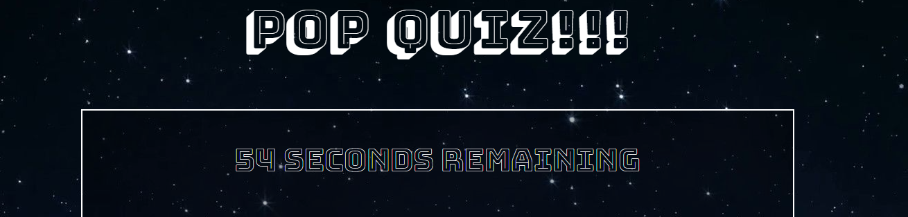

# Pop-Quiz
https://n7-gil.github.io/Pop-Quiz/

The purpose of this assignment was to create a fully functional quiz game. The game begins when the user selects the start button and must answer trivia questions before the timer expires. The game is still a work in progress as I will add a function that will punish the user when selecting an incorrect answer and will subtract time from their remaining time. Also need to add a leaderboard in the end so users can play against friends to compare how quickly they can solve the quiz.

[Pop-Quiz]: https://github.com/n7-gil/Pop-Quiz

